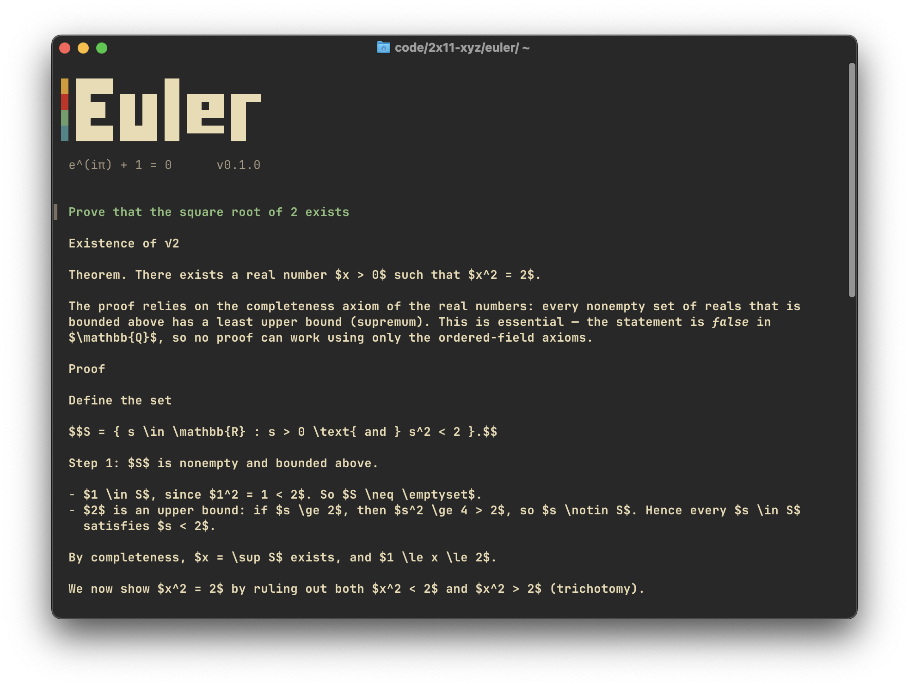
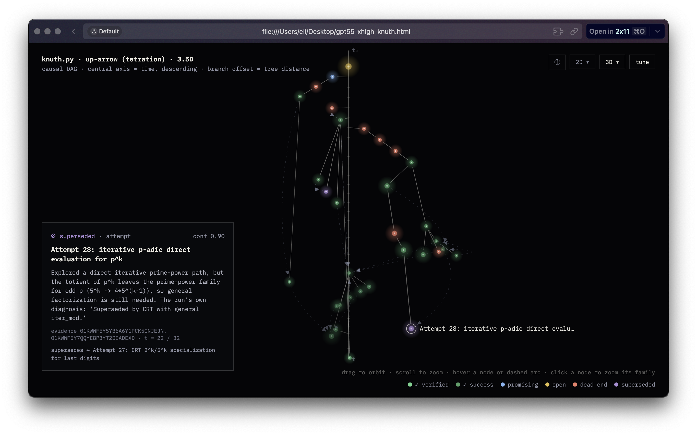

<p align="center"></p>

# Euler

**Euler is a research agent (coding agent included) and an open-ended
runtime-extensible platform.** Its small core is scaffolding for new agent
workflows: extensions can add commands, context slots, artifacts, checkpoints,
capabilities, and companion-agent patterns without changing the core. Euler
treats problem solving as a first-class artifact: every session is a
trustworthy, reconstructable record of what was tried, what died, and what
survived. Your agent's dead ends are data. Euler keeps them.

## Why Euler

- **First-class provenance.** An append-only event log captures every model call,
  tool invocation, permission decision, and reasoning artifact at provider fidelity. Narration is not evidence; artifacts are.

- **Clean canvas, durable memory.** Context stays focused while the event record
  remains intact. Under budget pressure, content may degrade to compact stubs, but
  facts about what happened are never silently lost.

- **Runtime-extensible core.** A small provenance-bearing core powers extensions
  via `euler-sdk`: commands, context slots, artifacts, checkpoints, and
  capabilities behind one host API. Extensions can be enabled, disabled, and
  selected per run. Bundled extensions include causal DAG, autoresearch,
  maxproof, code-swarm, session-export, and diagnostics-report.

- **Multi-model, multi-agent, trust-aware.** Supports OpenAI, Anthropic, and
  OpenRouter, with companion agents spawned inside sessions. Local-first by
  default: the OS account is the trust boundary, secrets are tainted and redacted,
  every permission decision is logged, and failures are verbose rather than silent.

The signature extension is the **causal DAG**: your session rendered as a
branching tree of attempts (open, blocked, inconclusive, successful, verified,
dead end, superseded, or abandoned) queryable by you *and by the agent itself*, so runs compound
instead of restarting.

<p align="center"></p>

<p align="center"><em>A real session: GPT-5.5 implementing Knuth's up-arrow notation: 32 attempts,
seven dead ends, two superseded prototypes, and the CRT path that won,
reconstructed from the provenance log alone by a second observer model.
Every node cites the events where it happened.
<a href="docs/examples/knuth-gpt55-xhigh.html">Explore the interactive version</a>
(self-contained HTML; download and open locally with 2D, 3D, and time-axis views).</em></p>

## Install

**Prebuilt binaries** (Linux x86_64/aarch64 static, macOS Intel/Apple Silicon) are on the
[releases page](https://github.com/2x11-xyz/euler/releases). Download, extract, and put
`euler` on your PATH:

```sh
tar xzf euler-<version>-<target>.tar.gz
sudo install -m 755 euler-<version>-<target>/euler /usr/local/bin/euler
```

**From source:**

```sh
git clone https://github.com/2x11-xyz/euler
cd euler
cargo build --release
# binary at target/release/euler
```

Rust 1.80+ recommended. Linux and macOS.

## Authenticate

```sh
# ChatGPT subscription (OAuth device flow)
euler login --provider chatgpt

# Anthropic / OpenAI / OpenRouter: API keys via environment
export ANTHROPIC_API_KEY=...
export OPENAI_API_KEY=...
export OPENROUTER_API_KEY=...

euler auth status
euler models
```

Any OpenAI-compatible endpoint can be added as a custom provider in
`~/.euler/providers.json`, including a local model behind ollama or vLLM, or a
self-hosted gateway. See the [headless guide](docs/guides/headless.md) for the
config shape.

## Run

```sh
# Interactive TUI
euler

# Headless: one task, full provenance, bounded rounds
# Default: indexed home session under ~/.euler/sessions/ (shows in /resume).
# Pass --provenance <path> for a standalone JSONL log instead.
euler exec --provider openrouter --model anthropic/claude-sonnet-5 \
  --auto-approve trusted-local \
  --max-tool-rounds 100 \
  "Read BRIEF.md in this directory and carry it out fully."
```

Useful exec flags: `--reasoning-effort xsmall..xlarge`,
`--auto-compaction off|stubs`, `--extensions <list|none>`,
`--auto-approve read-only|trusted-local`, `--provenance <path>`.

In the TUI: `/` lists actions; slash commands cover models, sessions, and
extensions.

## Extensions

Euler is designed as a platform, not a fixed agent. Bundled native extensions run
today and can be enabled, disabled, or selected per session. Local extension
packages can already be validated, linked, installed, searched, and audited; full
runtime execution for external packages is on the roadmap.

```sh
euler extension list
euler extension enable causal-dag
euler extension enable session-export
euler extension run causal-dag.export ./session.jsonl   # your session as a DAG
euler extension run session-export.session-export ./session.jsonl
```

Build your own with a native Rust crate implementing the `euler-sdk` traits,
registered alongside the bundled set. See
[docs/guides/extensions.md](docs/guides/extensions.md). The design contracts
extensions rely on live in [docs/contracts/](docs/contracts/).

## Documentation

- [Quickstart](docs/guides/quickstart.md): install → login → first session
- [Headless & long-horizon runs](docs/guides/headless.md): fleets, briefs,
  provenance monitoring, auto-compaction policies
- [Building extensions](docs/guides/extensions.md): SDK traits, commands,
  context slots, out-of-process status
- [The causal DAG](docs/guides/causal-dag.md): observations, hints schema,
  export, rendering
- [Design contracts](docs/contracts/): canvas, provenance, tools,
  capabilities, multi-agent, secrets
- [Roadmap](docs/roadmap.md): where this is going

## Status

v0.1.0 is nascent and moving fast. The core loop, providers, permissions,
provenance, and bundled extensions work today and are exercised daily by fleets
of Euler agents building Euler. Interfaces may still shift; the provenance
schema is versioned. Rough edges are tracked as
[GitHub issues](https://github.com/2x11-xyz/euler/issues).

## License

MIT
