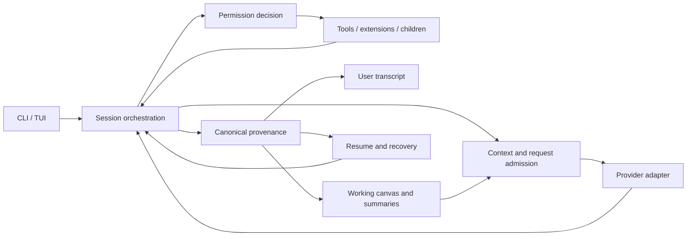

# Euler repository audit

Audit date: **2026-09-05**. Baseline: **`main` at `9dfb881`**, version 0.1.3. The working log was not retained; the PR threads for #211 through #224 carry the integration history.

> **Second-pass verification (2026-09-05, independent agent).** All 33 original findings were re-verified against the source by six parallel reviewers and the ten root probes were rebuilt and rerun. None were refuted. Priority changes: F08, F13, F28, F29 lowered; F12 raised. Amendments are marked **Second pass:** inside the affected findings. Five new findings F34–F38 were added, and the implementation order was revised to include them. See [Second-pass verification](#second-pass-verification) for the record.

## Assessment

Euler has a strong foundation for long-running research: a canonical event stream, separate transcript and working-canvas projections, explicit permissions, substantial contracts, and extensive tests. The highest-value investment is making those guarantees survive every lifecycle transition. The serious findings cluster around **grant → revoke → resume**, **guidance → summary → child**, **credential → tool output → checkpoint**, **model stream → failure → replay**, and **extension → approval → launch → shutdown**.

I would prioritize the permission, file-write, secret-retention, and agent-context findings before expanding workflows. Then unify the duplicated request/extension lifecycles and improve indexed access to long histories. The evidence supports focused changes to the existing architecture; it does not establish a need to replace the event log, rewrite the TUI, or change languages.

This report covers all seven crates and the major runtime flows, using source review, three delegated subsystem reviews, existing tests, synthetic failure probes, and local scaling measurements. It is a broad, deep engineering audit, not proof that every execution path is correct. Findings explicitly distinguish observed failures, source-backed risks, and design improvements.

## Repository model

| Component | Responsibility | Main audit concern |
| --- | --- | --- |
| `euler-event` | Canonical envelopes, event vocabulary, outcome helpers | Semantic identity and terminal-event invariants |
| `euler-sdk` | Extension contracts, descriptors, package state | Consistent materialization and activation transitions |
| `euler-managed-process` | Stdio JSON-RPC peers, deadlines, subprocess supervision | Ownership through failure, shutdown, and reaping |
| `euler-agents` | Agent tasks, targets, capabilities, budgets | Consistent interpretation by every execution path |
| `euler-provider` | Catalogs, authentication, request shaping, streaming | One resolved invocation contract; bounded, honest parsing |
| `euler-core` | Sessions, tools, permissions, provenance, canvas, compaction, agents | Durable policy and visibility across transformations |
| `euler-cli` | CLI/TUI, configuration and runtime integration | Shared lifecycle services and responsive metadata operations |

The central flow is:



The arrows are the important review boundaries. A decision made in one component must retain its meaning after persistence, projection, refresh, or delegation.

The repository contains approximately **185k Rust lines across 246 files**, including approximately **102k test lines** under a rough file/inline-test classification. These are orientation figures, not coverage percentages. Large implementation files include `session.rs` (~4,069 lines), TUI `app.rs` (~3,511), and `transcript.rs` (~2,326). Size matters where multiple invariants are interleaved; splitting files without clarifying ownership would accomplish little.

### Strengths to preserve

- Canonical provenance is separated from what the user sees and what the next model receives. This is the right foundation for inspectable long-duration work.
- Append reconciliation, resume validation, permission records, frozen project-context snapshots, and no-follow discovery show substantial attention to integrity.
- Agent budgets and deterministic parent-thread recording already provide useful scaffolding for parallel work.
- Managed extension framing and many tool/process failure cases already have explicit bounds and regression tests.
- The TUI already caches finalized rows, memoizes streaming rendering, shares line buffers, coalesces events, and debounces resize. Further rendering changes should build on those mechanisms.
- Contracts, ADRs, strict linting, and a large executable test suite make incremental hardening feasible.

## Macro changes and their micro implementation

| Macro improvement | Concrete implementation | Completion criterion |
| --- | --- | --- |
| Make authorization durable | Persist revocations; fold grants and revocations through one reducer; conservatively restrict static shell approval; revalidate extension consent at launch | Permission state after resume and after a delayed approval matches current authorized state |
| Make context actor-specific | Freeze the authorized parent base; append each child's own history; use canonical call identity; preserve source visibility through compaction | Excluded guidance stays excluded and a child always sees its own completed tool rounds |
| Resolve each invocation once | Build the exact final request, resolve target capabilities/output reserve, validate admission, then dispatch through a shared helper | Root, sequential child, parallel child, and shadow paths enforce the same applicable rules |
| Give secrets one lifecycle owner | Report resolved/refreshed credentials to the redactor; use consistent secret grammar; check known taint before checkpoint retention | Synthetic credentials do not enter protected durable artifacts through supported auth paths |
| Make extension lifecycle transactional | Share activation service between CLI/TUI; stage declarations before commit; contain every native callback; model process ownership explicitly | Failed registration/activation leaves coherent state; failed peers leave no owned descendants |
| Bound work before acquisition | Cap stream frames/indexes and capture buffers; stream range reads; avoid whole-history rescans | Memory and work remain bounded by useful input/output, with explicit truncation/coverage status |
| Make failures reconstructable | One terminal per model call; durable partial-failure artifacts; byte-oriented valid-prefix readers | Runtime, replay, resume, transcript, and CLI outcome agree about what happened |
| Test transitions and combinations | Add lifecycle matrices and composed CLI/TUI flows, plus macOS tests and reproducible scale probes | Tests exercise the combinations that produced this audit's defects |

Keep these as focused changes. New policy owners, event kinds, checkpoint ownership, and request-admission boundaries require the appropriate contract/ADR changes under `EULER.md`. Do not introduce a second authoritative store merely to make querying faster: indexes should be rebuildable projections of the canonical log.

## Findings

Priority definitions: **P1** = address first because of authorization, confidentiality, silent data loss, or a fundamental agent/recovery failure; **P2** = important correctness, reliability, or performance issue; **P3** = lower-impact consistency or maintenance issue. Priority is an engineering recommendation, not a CVSS rating. **Reproduced** means a synthetic local probe observed the stated behavior; **source-backed** means the control/data flow was traced without the full runtime scenario. Design gaps are identified separately.

### F01 — Automatic safe approval permits a file-writing command

**P1 · Reproduced.** [`command_safety.rs`](../../crates/euler-core/src/command_safety.rs), lines 398–411; [`session/tool_dispatch.rs`](../../crates/euler-core/src/session/tool_dispatch.rs), lines 100–160.

`uniq` is classified as read-only regardless of arguments. `uniq input.txt output.txt` creates or truncates the output file. With `FsWrite=AlwaysDeny` and `ShellExec=Ask`, the probe overwrote `output.txt`, called the permission decider zero times, and recorded `static-safe`.

This is a failure of the automatic read-only classification. It **does not bypass `ShellExec=AlwaysDeny`**; that branch remains denied. Explicitly approved arbitrary shell commands have different semantics from this automatic approval path.

**Change:** remove `uniq` from unconditional approval immediately, then validate any reinstated command by actual argument semantics. Review the remaining allowlist across supported command implementations. Prefer a conservative grammar that falls back to an ordinary permission decision when proof is incomplete.

**Acceptance:** synthetic output operands and mutating variants never receive `static-safe`; safe forms still work; `AlwaysDeny` and an earlier same-turn denial remain authoritative. Include BSD and GNU behavior where it differs.

**Second pass:** confirmed. `uniq` is the only entry in `READ_ONLY_BINARIES` that takes an output operand; flag denylists exist only for `find`, `rg`, `base64`, `sed`, and `git` (lines 115–121). The output path does pass `paths_confined`, so the clobber is limited to non-sensitive workspace files. See F34 for why that limit is insufficient.

### F02 — Static path checking does not match shell execution scope

**P1 · Reproduced.** [`command_safety.rs`](../../crates/euler-core/src/command_safety.rs), lines 91–184, 398, and 421.

Three automatically approved commands read a synthetic file outside the workspace through symlinks: `cat *.txt`, `cd nested && cat view.txt`, and `rg --follow SYNTHETIC .`. A direct `cat public.txt` correctly rejected the same outside symlink. Glob words are checked before expansion, segments reuse the original root rather than the shell's changed directory, and recursive traversal is not equivalent to checking the supplied directory argument.

**Change:** initially require normal approval for unquoted globs, directory-changing compound lists, and traversal modes that can follow links. If automatic handling is later restored, it must model actual execution paths and remain conservative under filesystem changes. Static analysis alone cannot provide race-free filesystem confinement; retain OS enforcement where available.

**Acceptance:** direct, expanded, nested-cwd, and recursive variants have equivalent confinement behavior, including sensitive basenames and links changed during approval. The `grep -R` variant did not reproduce on this Mac and is not asserted here. Linux sandbox effectiveness was not measured by these macOS probes.

### F03 — A revoked session grant returns after resume

**P1 · Reproduced.** [`session.rs`](../../crates/euler-core/src/session.rs), line 1598; [`resume.rs`](../../crates/euler-core/src/resume.rs), lines 408–440.

`Session::revoke_grant` updates permission state, but an unscoped session revocation is not represented in provenance. Resume folds the earlier session-scoped allow back into active permissions. The probe granted filesystem writes, revoked the grant, resumed with a denying decider, and successfully wrote again without consulting that decider.

**Change:** record durable revocation with an unambiguous scope/identity and fold it in event order alongside grants. Make persistence failure explicit and prevent a supposedly revoked session from silently resuming with the old authority. Preserve the existing restrictions on which historical grants may be restored; do not accidentally expand patterned-grant support.

**Acceptance:** grant → revoke → resume stays revoked; revoke → regrant → resume restores only the new grant; interrupted batches and failed persistence cannot revive authority. Exercise the actual permissions UI/API and resume together.

**Second pass:** confirmed. The event vocabulary in `crates/euler-event/src/lib.rs` has only `permission.prompt` and `permission.decision`; no revocation kind exists. The fold at `resume.rs:614–616` replays every historical session allow as `SessionAllow`. The same gap covers explicit mode changes; see F35.

### F04 — Prepared writes overwrite changes made after preparation

**P1 · Reproduced.** [`tools.rs`](../../crates/euler-core/src/tools.rs), lines 620–684.

Preparation records a path and intended contents; application later calls `fs::write` without validating the preimage or create-only condition. A prepared create overwrote an intervening user-created file. A prepared edit silently discarded an intervening user edit. A changed directory/symlink path is a related source-backed confinement concern; that race was not separately reproduced.

**Change:** use no-clobber creation for additions, validate the expected preimage and target identity for edits, and replace files atomically where supported. Handle permissions/metadata deliberately. Preserve a durable permitted preimage before the destructive change and give conflicts a distinct outcome so the agent can re-read and reprepare. Path validation and mutation need stable filesystem handling, not only another string check.

**Acceptance:** intervening create/edit/delete/link swap produces a conflict with original user bytes preserved; cancellation before mutation stays harmless; successful edits and rollback retain intended content and metadata. Inject write/checkpoint failures to verify ordering.

**Second pass:** confirmed. `before_sha256` is already computed at prepare time (line 631) and stored on the patch, so the preimage check is a one-line comparison at apply. The checkpoint ordering problem this creates is F36.

### F05 — Credential resolution and refresh bypass known-value redaction

**P1 · Reproduced schema/sink gap; refresh consequences source-backed.** [`session_lifecycle.rs`](../../crates/euler-cli/src/session_lifecycle.rs), lines 127–145; [`provider/lib.rs`](../../crates/euler-provider/src/lib.rs), lines 530–534; [`auth_validation.rs`](../../crates/euler-cli/src/auth_validation.rs), lines 100–108 and 149–160; [`chatgpt.rs`](../../crates/euler-provider/src/chatgpt.rs), lines 93–109.

Startup seeding parses an explicit auth file as core `AuthStorage`, while the legacy ChatGPT adapter intentionally reads a different `{tokens}` schema. A valid synthetic legacy file loaded in the adapter, failed core storage parsing, and produced zero secret-sink notifications. Built-in adapters use the no-op sink. Request-time resolution of stored environment references, OAuth refresh, and external credential rotation can therefore introduce values absent from the startup redaction snapshot.

**Impact:** echoed credentials in tool/context/error surfaces can evade known-value redaction. Recognized token shapes mitigate some keys, but do not cover arbitrary values and all OAuth material. This is a coverage defect, not evidence that every request leaks a credential.

**Change:** report successfully resolved and newly refreshed secrets through one shared observer before use, across built-in and custom adapters. Let the owning adapter parse legacy credentials. Preserve the shared redactor and existing auth rotation locking.

**Acceptance:** synthetic legacy tokens, a key referenced through an innocuously named environment variable, refresh, and file rotation all enter the known-value set and disappear from protected durable tool/context/error artifacts.

**Second pass:** confirmed, with one mitigation the original text omits. The ChatGPT adapter keeps a provider-local scrub list of its own tokens (`chatgpt.rs:222–232`) and applies it to provider error bodies and the WebSocket path. Provider **error** surfaces are therefore covered for legacy tokens; **tool output** that echoes the auth file is not. The only `set_resolved_secret_sink` implementor is `custom_provider.rs:82`; Anthropic, OpenAI, ChatGPT, and the fixture provider inherit the no-op at `lib.rs:534`.

### F06 — Checkpoints store bytes already known to contain a secret

**P1 · Reproduced storage/admission gap; session call chain traced.** [`session/tool_dispatch.rs`](../../crates/euler-core/src/session/tool_dispatch.rs), lines 193–233 and 519–524; [`session/companion.rs`](../../crates/euler-core/src/session/companion.rs), line 567; [`checkpoints.rs`](../../crates/euler-core/src/checkpoints.rs), lines 42–55; [`file_diff.rs`](../../crates/euler-core/src/file_diff.rs), lines 344–390.

The patch event is redacted, but checkpoint storage receives the original `patch.before`. Its heuristic does not consult the session's known-value redactor. A registered synthetic secret in an ordinary `host = ...` file passed checkpoint admission and remained in the stored bytes. The ledger can look sanitized while `.euler/checkpoints` retains the raw value.

**Change:** apply known-value and token-shape detection before retaining checkpoint bytes. Omit a tainted checkpoint and report why. **Do not redact the rollback preimage**: that would silently change what rollback restores. Cover root and companion edits.

**Acceptance:** ordinary rollback restores byte-for-byte; an already registered canary yields no raw checkpoint blob and an explicit omission reason; the event payload remains properly redacted.

**Second pass:** confirmed. The admission gate at `file_diff.rs:344–349` is a fixed substring list plus `secret_like_path`. That path check (`file_diff.rs:356–363`) tests `path == ".env" || path.contains("/.env")`, so a root-level `.env.local` or `.env.production` passes the path gate. Add these to the acceptance matrix.

### F07 — Overlapping known secrets are only partly redacted

**P2 · Reproduced.** [`redaction.rs`](../../crates/euler-core/src/redaction.rs), lines 263–293; compare longest-first preparation in [`scrub.rs`](../../crates/euler-core/src/scrub.rs), lines 38–49.

Registering `prefix12` before `prefix12-canary-sensitive-tail` causes the longer value to become `[redacted-secret]-canary-sensitive-tail`. Replacing the short prefix prevents the subsequent full-secret match.

**Change:** identify known-value match spans in the original input, merge overlapping spans, and replace each covered span once. Descending-length replacement fixes the reproduced prefix case but alone does not fully handle two overlapping values that do not contain one another. Avoid rematching inserted markers. A multi-pattern matcher is optional after measuring actual list sizes and output volume.

**Acceptance:** both registration orders, partial overlap, adjacency, Unicode, and marker-like secret values redact completely without altering unrelated text.

### F08 — Scrubbing one session breaks another session's rollback

**P3 (lowered from P2 in second pass) · Reproduced.** [`provenance/scrub.rs`](../../crates/euler-core/src/provenance/scrub.rs), lines 139–153, 220–225, 360–363, and 424–445; [`checkpoints.rs`](../../crates/euler-core/src/checkpoints.rs), lines 58–75 and 119–120.

Checkpoint blobs are workspace-global and content-addressed. Sessions A and B can reference the same hash. Scrubbing A rewrites its references and removes/sanitizes the old blob without updating B. The probe left B's hash unchanged and made B's restore fail with `NotFound`.

**Change:** choose explicit checkpoint ownership. Session-scoped retention is simpler; a shared store requires reference tracking, coordinated session updates/locking, and a surfaced scrub scope. Keeping the old secret blob silently would preserve rollback by violating the scrub guarantee, so it is not an acceptable hidden workaround.

**Acceptance:** shared-reference and active-other-session cases preserve documented rollback/privacy semantics, including crashes partway through scrub. This needs an ownership decision and migration plan, not just a local deletion tweak.

**Second pass:** confirmed but lowered. The rewrite short-circuits when `replacements == 0` (`provenance/scrub.rs:356`), so session B's blob is only affected when B's preimage **contains the scrubbed secret**, which is precisely the content the scrub is meant to destroy. Breaking B's rollback is the safer failure. The actual defect is a bare `NotFound` instead of an explained "pre-image scrubbed" outcome. Fix the message first; treat ownership redesign as optional.

### F09 — An empty token-limited completion makes the session unresumable

**P1 · Reproduced.** [`session.rs`](../../crates/euler-core/src/session.rs), lines 600–656; [`resume.rs`](../../crates/euler-core/src/resume.rs), line 762 onward.

An empty `MaxTokens` response records `model.result`, then a provider error parented to that result. Resume interprets the error as another model terminal and fails with `DuplicateModelTerminal`. The turn fails honestly in memory but creates a log its own recovery logic rejects.

**Change:** define exactly one terminal event per model invocation. Represent an unsuccessful stop in that terminal, or distinguish a post-result turn failure from a provider-call terminal. Use one lifecycle validator for live emission and resume. Keep duplicate-terminal rejection for truly malformed histories.

**Acceptance:** empty `MaxTokens`, `Refusal`, and `Error`, plus successful and failed tool rounds, remain inspectable/resumable with one terminal and an honest user outcome. Add an explicit compatibility approach for histories already emitted in this shape.

**Second pass:** confirmed end to end with the built CLI: `exec --resume` fails with `resume incompatible: terminal event … duplicates the closed model call`. `--replay` still works. With two or more prior settled root calls the error becomes `AmbiguousModelTerminal` (`resume.rs:822–827`) instead. The writer violates the "exactly one semantic terminal association" rule at `docs/contracts/events.md:134`. The companion and parallel paths (`companion.rs:851`, `parallel_spawn.rs:548`) do **not** double-terminate, so the fix is root-only. The existing test `tool_free_max_tokens_round_with_no_content_fails_honestly` (`session_loop.rs:7088`) asserts one error event but never resumes, so the regression is untested.

### F10 — Failed streams lose their captured partial output from durable provenance

**P2 · Reproduced.** [`session.rs`](../../crates/euler-core/src/session.rs), lines 2462, 3158, and 3189; [`provenance.rs`](../../crates/euler-core/src/provenance.rs), line 1427.

A fake provider emitted `PARTIAL_RESEARCH_EVIDENCE_CANARY`, then a transport error. The marker existed in in-memory events but disappeared from `read_provenance`. Deltas are intentionally runtime-only, and failure discards the accumulated round data while persisting only the error message/category. The vision explicitly calls for keeping partial streams and failed paths as evidence.

**Change:** persist captured partial data as a clearly incomplete failure artifact associated with the invocation, using existing confidentiality and blob rules. Do not synthesize a successful `model.result` or feed failed content into the normal successful canvas by default.

**Acceptance:** text → transport failure and reasoning/tool-fragment → failure retain available evidence after restart, preserve exactly one terminal, and clearly distinguish complete tool calls from unusable fragments. Test cancellation separately according to its chosen retention policy.

**Second pass:** confirmed as fact; classified as a design tension rather than a defect. The discard is at `round_loop.rs:349`, where the provider error path drops the accumulated round data. Delta non-persistence is explicit policy (`events.md:53`, `events.md:402`), but `docs/vision.md:60` states that partial streams belong in provenance and nothing implements that. Retry is correctly disabled once deltas were seen (`round_loop.rs:294–297`).

### F11 — Partial token-limited output has the same return shape as completion

**P2 · Reproduced behavior; outcome/API design gap.** [`session.rs`](../../crates/euler-core/src/session.rs), lines 630–656.

Text followed by `MaxTokens` returns normal `Ok` and emits `assistant.message`. The stop reason **is preserved in provenance**, so this is not missing finish metadata. The gap is that callers and users cannot reliably distinguish completed work from a capped partial answer through the ordinary turn result.

**Change:** introduce a typed terminal outcome such as completed/incomplete/capped/refused, keep usable partial text, and present the stop honestly in CLI/TUI/export. Determine exit-status compatibility for scripts before changing it.

**Acceptance:** identical visible text with `Completed` versus `MaxTokens` produces distinguishable turn outcomes and displays while preserving raw finish metadata. Avoid retrying or continuing automatically without a defined budget policy.

**Second pass:** confirmed with the built CLI: partial text plus `max_tokens` prints as a normal assistant message and exits 0; only the log records the stop reason. No code in `euler-cli` reads `stop_reason` outside the fixture script. **Inconsistency across drivers:** the root turn treats a partial cap as success, while the companion and parallel paths treat `MaxTokens` as a failure (`companion.rs:851`, `parallel_spawn.rs:548`). Whatever outcome type F11 introduces should be applied to all three.

### F12 — Reused provider tool-call IDs remove later results from the canvas

**P1 (raised from P2 in second pass) · Reproduced.** [`canvas.rs`](../../crates/euler-core/src/canvas.rs), lines 901–948.

Pairing globally keys `calls_by_id` and `paired_call_ids` by the provider payload ID. Two valid sequential model rounds that reuse that ID leave two tool results in provenance but only the first in the working canvas. Provider-local identifiers should not be session-global identity.

**Change:** pair through the canonical tool-call envelope and authoritative causal link, with actor/model-call scope where needed. Keep payload IDs for provider wire compatibility. Use the same identity rules in compaction, replay, and child projections.

**Acceptance:** reused IDs across rounds and agents retain each correct call/result pair; duplicate/malformed results within one call still reject or remain ineligible. Live and resumed canvases must agree.

**Second pass:** confirmed and raised. This is silent context loss, not a projection oddity: on round three the model's request contains only the first call/result pair, the second file the model read is invisible to it, and no warning is emitted. `calls_by_id.entry(call_id).or_insert_with(...)` at `canvas.rs:913–915` keeps the first call and `canvas.rs:923–925` skips later results. The fix has an available identity already: every `tool.result` envelope parents its `tool.call` (`tool_dispatch.rs:263`, `events.md:688`). Anthropic and OpenAI ids are unique in practice, but custom OpenAI-compatible endpoints are a supported configuration and nothing validates id uniqueness at the boundary.

### F13 — A torn UTF-8 tail prevents inspection of the valid log prefix

**P3 (lowered from P2 in second pass; P2 for read-only replay) · Reproduced.** [`provenance.rs`](../../crates/euler-core/src/provenance.rs), lines 515 and 551; [`resume.rs`](../../crates/euler-core/src/resume.rs), line 462.

Whole-file `read_to_string` fails before prefix handling when the final incomplete fragment contains a partial multibyte character. Both replay and resume-prefix reading reject the file, while `query_provenance` returns the complete prefix correctly.

**Change:** locate complete record boundaries at the byte level, decode complete records, and classify the residual tail separately. Preserve the current policy that a readable torn tail permits inspection but fences continuation; any repair/truncation should remain explicit.

**Acceptance:** truncate a UTF-8 event at every byte position: complete earlier events remain inspectable; malformed complete interior records still fail; no new append is silently admitted over an unresolved tail.

**Second pass:** confirmed with the built CLI, but the incremental impact is smaller than the original grade implies. With an **ASCII** torn tail, `--replay` already succeeds while `--resume` and append already fail closed with `provenance log has bytes beyond its confirmed durable tail` (`provenance.rs:240–244`). The UTF-8 tear therefore adds only two things: read-only replay breaks, and the resume error message becomes the unhelpful `stream did not contain valid UTF-8`. Fix is cheap: read bytes, trim to the last newline, then decode.

### F14 — Compaction carries excluded project guidance into children

**P1 · Reproduced.** [`session.rs`](../../crates/euler-core/src/session.rs), lines 2714–2724, 3691–3703, and 3912–3916; [`canvas.rs`](../../crates/euler-core/src/canvas.rs), lines 399–405.

The summarizer receives pinned project context, but its output becomes an ordinary unclassified `Projection`. A child using `project_context:none` removes typed project items while retaining that summary. A marker appearing only in synthetic `EULER.md` reached the child's prompt even though the child had **zero typed project-context items**. This undermines the intended independence of review/worker contexts.

**Change:** exclude classified guidance/skill material from any shared unclassified summary, or preserve derivation visibility and maintain an appropriate projection/frontier for children that exclude those sources. Simply dropping a mixed summary can also erase the child's required non-project history; account for that explicitly.

**Acceptance:** summary → child-none, skill result → summary → child-none, and compaction → resume → child-none retain permitted work history without the excluded marker. Test inherited-project children as well.

**Second pass:** confirmed, and the contract makes this a hard guarantee rather than best effort. `docs/contracts/project-context.md:490–491` states child assembly filters the complete class "even when `include_parent_canvas` is true", and `session.rs:3684–3685` describes it as a data-flow property. The summary projection at `canvas.rs:399–405` carries no `snapshot_digest`, so it escapes classification. The compaction worker (`compaction_worker.rs`) has no project-context references at all, so there is no compensating filter on that path either. Exposure today: any `include_parent_canvas: true` child after a compaction.

### F15 — An isolated companion forgets its own tool results

**P1 · Reproduced.** [`session/companion.rs`](../../crates/euler-core/src/session/companion.rs), lines 814–825 and 929–960.

With `with_parent_canvas(false)`, canvas assembly returns empty on every round. A two-round child that read a file made its second request with only the task and **zero own tool outputs**. Excluding the parent's history inadvertently excludes the child's developing history too.

**Change:** freeze the authorized optional parent base at spawn, then append the child's own events every round. Apply visibility policy to the appropriate sources. This also enables cheaper actor-specific incremental assembly.

**Acceptance:** on round two the parent marker is absent but the child's tool output and required call/reasoning pairs are present. Exercise denied tools, both parent-canvas settings, project-context inheritance, and child budgets. Existing single-round isolated and multi-round inherited tests do not cover this combination.

**Second pass:** confirmed. The child's own tool events **are** appended to the shared parent bus (`companion.rs:260`, `314`, `616`), so the data exists; `prepare_model_request` (`companion.rs:929–939`) simply never reads it when the flag is off, and `round_loop.rs:227–233` rebuilds the request fresh each round. Test coverage check: the only `with_parent_canvas(false)` test (`companion_test.rs:1079`) is single-round and asserts an input length of two. Related visibility gaps are in F37.

### F16 — Child request admission differs by execution path and target

**P2 · Sequential bypass reproduced; heterogeneous-target issue source-backed.** [`session/companion.rs`](../../crates/euler-core/src/session/companion.rs), lines 887–972; [`session/parallel_spawn.rs`](../../crates/euler-core/src/session/parallel_spawn.rs), lines 307–322.

An 8 KiB explicit context with a 10-token context limit dispatched successfully through `spawn_companion`. The identical parallel reviewer request was rejected before dispatch as requiring 2,339 tokens. Sequential assembly checks inherited canvas retention, not the final request token requirement. Parallel admission also uses the parent's configured context window rather than the resolved reviewer's target window.

**Change:** resolve the actual target and construct/filter the final request before admission. Count instructions, explicit context, tool schemas, actor history, and output reserve through one shared helper, then record `model.call` only for a request that enters the provider lifecycle.

**Acceptance:** equivalent root/sequential/parallel requests make equivalent admission decisions; smaller/larger child-model windows use their own limits; local rejection makes zero provider calls and no misleading in-flight invocation record.

### F17 — ChatGPT stream corruption is silently accepted

**P2 · Reproduced.** [`sse.rs`](../../crates/euler-provider/src/sse.rs), lines 95–132 and 248–269; shared WebSocket use in [`chatgpt_websocket.rs`](../../crates/euler-provider/src/chatgpt_websocket.rs), lines 124–132.

Malformed JSON is discarded with `.ok()?`; a following completed frame makes the stream appear successful. Malformed tool arguments become `Null`, while missing identifiers/arguments receive synthesized defaults. Probes observed malformed-frame → `Finished(Completed)`, malformed arguments → `ToolCall { input: Null }`, and duplicate completed frames → two parser terminal events. The root normally stops at the first terminal, limiting the last symptom's direct impact.

**Change:** reject malformed JSON and invalid recognized schemas/tool arguments with sanitized protocol errors; validate required IDs/names; enforce one terminal. Continue accepting genuinely unknown event types for forward compatibility. Share framing and negative conformance cases between SSE and WebSocket.

**Acceptance:** corrupt known events fail at the provider boundary before tools execute; partial evidence follows F10; unknown event types remain compatible; duplicate terminals and data after termination have defined behavior. Other adapters' existing strict parsing provides a useful reference.

**Second pass:** confirmed for SSE. The WebSocket path is protected against duplicate terminals by its `done` flag (`chatgpt_websocket.rs:127–129`); the SSE `push_json` (`sse.rs:93–118`) is not. **The Anthropic parser shares two of these defects:** `flush_event` (`anthropic.rs:544–566`) has no `terminal_event_seen` guard before emitting `Finished`, so a second `message_delta` yields two terminals, and tool `id`/`name` default to empty strings via `string_field` (`anthropic.rs:620`). The chat-completions parser is the strict reference: it guards on `terminal_event_seen` (`chat_completions.rs:552`), uses `set_once` for id/name (`650–655`), and errors on invalid argument JSON (`710–716`). Extend the acceptance matrix to Anthropic.

### F18 — UI availability checks can block on OAuth refresh

**P2 · Source-backed.** [`provider/lib.rs`](../../crates/euler-provider/src/lib.rs), lines 657–675; [`chatgpt.rs`](../../crates/euler-provider/src/chatgpt.rs), lines 93–94; [`auth_validation.rs`](../../crates/euler-cli/src/auth_validation.rs), lines 149–157; [`ui/app.rs`](../../crates/euler-cli/src/ui/app.rs), lines 875, 1008, and 1053–1056; [`chatgpt_device.rs`](../../crates/euler-provider/src/chatgpt_device.rs), lines 229–233; [`auth_storage.rs`](../../crates/euler-core/src/auth_storage.rs), lines 318–338.

`authenticated_provider_ids` calls provider validation; ChatGPT validation loads credentials and may refresh them. Startup/picker rebuilding performs this synchronously on the UI path, even when another provider is selected. Refresh holds the auth store's cross-process exclusive lock. The underlying ureq defaults have a 30-second connect timeout but no read/write/overall timeout, so a connected stalled endpoint can block indefinitely.

**Change:** separate side-effect-free readiness/presence metadata from request-time credential resolution. Refresh during invocation or explicit auth operations, with tight auth transport deadlines. Preserve lock/re-read discipline needed for rotating refresh tokens.

**Acceptance:** opening/rebuilding model selection performs zero refresh/network calls; expired-but-refreshable and malformed credentials have honest metadata states; stalled synthetic refresh is bounded and does not freeze terminal input. No real auth endpoint was exercised in this audit.

**Second pass:** confirmed; ureq 2.12.1 defaults are `timeout_connect: 30s`, `timeout_read: None`, `timeout: None`. The doc comment on `authenticated_provider_ids` at `lib.rs:656–658` says the check is "not a network call" and "cheap enough to run when populating a picker"; that is false for ChatGPT and should be corrected with the fix. The read-timeout gap is not limited to auth; see F38.

### F19 — Accepted custom compatibility requirements do not affect requests

**P2 · Reproduced using localhost capture.** [`provider_config.rs`](../../crates/euler-provider/src/provider_config.rs), lines 443–452 and 668–675; [`chat_completions.rs`](../../crates/euler-provider/src/chat_completions.rs), lines 35–103, 257–268, and 355–373.

The config accepts `requires_tool_result_name` and `requires_assistant_after_tool_result`, but runtime shaping does not consume them. With both enabled, a captured request omitted the tool result's `name` and ended with the tool message rather than the required assistant continuation. No config warning was emitted.

**Change:** translate validated configuration into typed runtime options and implement the required wire transformations, or explicitly reject unsupported flags. Do not silently accept a requirement that cannot be honored. Merely unused `supports_*` declarations are weaker evidence and are not counted as equivalent failures.

**Acceptance:** table-driven request-body tests verify each supported compatibility option individually and in combination; unsupported requirements produce actionable diagnostics before a network call.

**Second pass:** confirmed by crate-wide grep: both fields appear only in the config lint accept-list (`provider_config.rs:445`, `448`, `672`, `673`) and its tests. `supports_developer_role` and `supports_strict_tools` are likewise accepted but never read; include them in the same fix.

### F20 — Built-in OpenAI drops the selected reasoning effort

**P2 · Source-backed.** [`openai.rs`](../../crates/euler-provider/src/openai.rs), lines 12–19; [`chat_completions.rs`](../../crates/euler-provider/src/chat_completions.rs), lines 25–60.

OpenAI uses `first_party_five_minute_cache()`, which leaves `reasoning_request: None`. Request shaping consumes the selected effort only when this option is present. The catalog/CLI expose reasoning choices, but changing the selection does not change the built-in OpenAI request's reasoning field.

**Change:** resolve model-aware OpenAI wire options and send the supported effort field for applicable models. Preserve omission for models that do not support it. Record applied behavior where it differs from requested behavior. The similarly absent xAI field is explicitly documented as intentional and is not included in this finding.

**Acceptance:** low/high effort choices produce the intended distinct wire requests for supported models; non-reasoning models omit the field; tests require no paid API call.

### F21 — Refreshed catalog capabilities disagree with adapter validation

**P2 · Reproduced with a synthetic updated catalog.** [`provider/lib.rs`](../../crates/euler-provider/src/lib.rs), lines 619–625 and 689–699; [`chatgpt.rs`](../../crates/euler-provider/src/chatgpt.rs), lines 98–107; [`catalog.rs`](../../crates/euler-provider/src/catalog.rs), lines 1137–1154; [`anthropic.rs`](../../crates/euler-provider/src/anthropic.rs), lines 144–159.

The host and UI use the active merged catalog, while ChatGPT validation and some Anthropic capability decisions read embedded metadata. A valid synthetic updated catalog admitted `max` for `gpt-5.5`, but the adapter rejected it before authentication/network access. This demonstrates drift under a supported catalog update; it is not a claim that today's embedded catalog disagrees with itself.

**Change:** pass one resolved capability/options object into invocation, or inject the active catalog into adapters. Preserve adapters' ownership of wire semantics while removing competing capability snapshots.

**Acceptance:** a compatible newer catalog drives selection, admission, validation, and request shaping consistently; stale/invalid updates fail through one documented policy; requested and effective model choices remain inspectable.

### F22 — Custom-provider secret syntax differs from the documented resolver

**P3 · Reproduced.** [`secrets.md`](../contracts/secrets.md), line 11; [`custom_provider.rs`](../../crates/euler-provider/src/custom_provider.rs), lines 212–243; [`auth_storage.rs`](../../crates/euler-core/src/auth_storage.rs), lines 480–531.

`${KEY_PREFIX}_API_KEY` is documented and supported for stored auth. The custom resolver only unwraps an entire `${NAME}` and rejects the constructed form's braces. A valid synthetic configuration parsed without warnings but failed authentication with `env reference is invalid`.

**Change:** share the expression grammar and resolution semantics at an appropriate dependency owner. Keep presence inspection separate from execution and retain explicit policy differences for `!command` secrets.

**Acceptance:** run the same literal/reference/constructed-name expression table through both resolvers; meaningful diagnostics identify missing values versus invalid syntax; inspection never executes a command.

### F23 — Provider-controlled indexes and frames can cause excessive allocation

**P2 · Source-backed resilience risk; no OOM probe.** [`chat_completions.rs`](../../crates/euler-provider/src/chat_completions.rs), lines 493–506 and 643–647; [`anthropic.rs`](../../crates/euler-provider/src/anthropic.rs), lines 491–504, 599–606, and 835–838; [`sse.rs`](../../crates/euler-provider/src/sse.rs), lines 18–30.

External block/tool indexes drive `Vec::resize_with(index + 1)`. A sparse large index allocates in proportion to the index rather than useful work; allocation failure may terminate the process. SSE line/data buffers also grow without a cap when a peer withholds a newline. An ordinary panic boundary does not reliably contain allocator aborts.

**Change:** validate numeric conversion, maximum indexes/counts, and cumulative frame/tool-argument/reasoning bytes before allocation. Use bounded sparse structures if the protocol permits noncontiguous indexes. Put common framing limits in one implementation while keeping protocol semantics adapter-owned.

**Acceptance:** huge/sparse indexes, overlong lines, many tiny chunks, and oversized arguments fail deterministically with bounded memory and a provider error; normal long valid streams remain supported within documented limits.

### F24 — Auth status and invocation use different credential precedence

**P3 · Source-backed.** [`auth_storage.rs`](../../crates/euler-core/src/auth_storage.rs), lines 247–269 and 681–695; [`auth_validation.rs`](../../crates/euler-cli/src/auth_validation.rs), lines 94–100.

Status can mark an empty/unresolved API-key entry valid. A malformed stored entry can fall back to an environment status, while actual invocation intentionally treats any stored entry as authoritative and disables that fallback. The user can see `valid/env` but still be unable to invoke.

**Change:** derive readiness metadata from the same precedence rules as credential resolution, without performing network validation. Distinguish configured, locally resolvable, expired-but-refreshable, and invalid states.

**Acceptance:** missing, blank, malformed, referenced, expired, and environment-fallback cases yield status consistent with the resolver's next action.

### F25 — Nonzero managed shutdown leaves owned descendants alive

**P2 · Reproduced.** [`runtime.rs`](../../crates/euler-managed-process/src/runtime.rs), lines 681, 703, and 761–767; [`extension-sdk.md`](../contracts/extension-sdk.md), lines 516–519.

Shutdown calls `try_wait`, marks the leader reaped even on nonzero exit, then returns an error. `abort` skips group cleanup when `child_reaped` is true. A synthetic peer exited 1 after completing the shutdown/exit exchange; the host returned failure in ~75 ms, but its ordinary child wrote a marker a second later. The child then self-exited. The failure cleanup contract promises group termination before reaping.

**Change:** observe exit status while retaining safe ownership of the unreaped leader, stop the group on failure, then reap and finish pipe draining. An exit observation mechanism such as Unix `waitid` with `WNOWAIT` is one option. Do not signal a potentially reused numeric PGID after ownership has been lost.

**Acceptance:** delayed descendant side effects do not occur after cleanup completes for nonzero exit, malformed shutdown, final output overflow, timeout, or cancellation. Account for the documented cancellation grace before cleanup completes. Preserve the explicitly documented clean-success policy that successful packages own their descendants.

**Second pass:** confirmed. `try_wait` sets `child_reaped = true` unconditionally (`runtime.rs:761–768`) before the nonzero-exit error; `abort` (`runtime.rs:696–705`) gates both cancel-request and the only `SIGKILL -pgid` site on `!child_reaped`. **The `OutputLimitExceeded` branch at `runtime.rs:681–683` has the identical gap**: the leader is already reaped by the preceding wait, so group cleanup is skipped. Timeout and pre-poll cancellation are fine. Because surviving descendants hold the protocol pipes, `finish_io` (`784–789`) waits out the full cancel grace. Arguably P1 if descendants commonly hold pipes.

### F26 — TUI Add composes an impossible link/install transition

**P2 · Source-backed UI flow plus reproduced SDK transition.** [`ui/app/extension_runs.rs`](../../crates/euler-cli/src/ui/app/extension_runs.rs), lines 372–403; [`extension_package.rs`](../../crates/euler-sdk/src/extension_package.rs), line 500; [`extension_registry.rs`](../../crates/euler-core/src/extension_registry.rs), line 305.

Add links the package, then installs the same ID. SDK installation rejects a Linked record with `ModeConflict`. The first mutation remains, while the success/enable path cannot complete. Re-adding an enabled linked package can revoke its consent before failing. Removing the install call alone is insufficient because generic `enable` differs from linked launch consent.

**Change:** share the supported CLI activation service: validate → link → explicit launch review/consent → activate. Keep installed materialization distinct while it is intentionally inert. Make partial failure state honest and avoid disabling an unchanged existing package on a failed Add.

**Acceptance:** in a temporary home, TUI Add of a valid managed package produces matching displayed/registry activation and a runnable command. Exercise existing-linked, installed, invalid-package, and persistence-failure cases. Preserve the SDK mode-conflict guard.

**Second pass:** confirmed and sharpened: the feature is **fully broken, not fragile**. `link_package` (`extension_registry.rs:303–306`) always inserts a Linked record and revokes launch consent at line 305; `apply_install_package` (`extension_package.rs:499–506`) returns `ModeConflict` for any Linked record, which is now always the case. Outcomes by starting state: fresh package → left linked, disabled, error shown; already linked and enabled → consent silently reset to false, then error, so a working extension is disabled; already installed → link fails with `ModeConflict`. The CLI is correct only because link and install are separate subcommands never chained (`extension_cli.rs:285–307`). No test references `add_local_extension`. Together with F27 the TUI add path is unreachable twice over on first run; ship these two together.

### F27 — The empty extension manager cannot open Add

**P2 · Direct control-flow finding; no live terminal reproduction.** [`ui/bottom_surface.rs`](../../crates/euler-cli/src/ui/bottom_surface.rs), lines 299–311; [`ui/bottom_surface/picker.rs`](../../crates/euler-cli/src/ui/bottom_surface/picker.rs), lines 207 and 531.

The key handler obtains a selected row with `?` before matching `'a'`. An empty registry has no selected row, so it returns before handling Add, even though the picker advertises `a add`.

**Change:** handle selection-independent actions first; only toggle/remove/details should require a row.

**Acceptance:** an empty manager accepts `a` and opens the path prompt; nonempty actions and saved-draft restoration remain correct. This small fix can ship independently of the broader activation service work.

### F28 — Failed native registration leaves executable partial state

**P3 (lowered from P2 in second pass) · Reproduced through the public native API.** [`extensions.rs`](../../crates/euler-core/src/extensions.rs), lines 229–243 and 1584.

Full registration inserts the extension, then validates/inserts commands sequentially. A valid command followed by an invalid capability descriptor returns a registration error but leaves the earlier command executable; retrying the extension ID fails as a duplicate. Shipping managed package execution uses command-scoped validation, so this is not a demonstrated managed-package capability bypass.

**Change:** stage and validate the entire declaration before committing any extension/command registry mutation. Share validation where practical with declaration and command-scoped paths.

**Acceptance:** invalid first/middle/last commands leave no part of the rejected extension installed, preserve unrelated registrations, and allow a corrected retry with the same ID.

**Second pass:** mechanics confirmed, exposure lowered. The full `register_extension` API has **no production callers**; only `session_test.rs` and `tests/extension_panic_hook.rs` use it. Production goes through `register_extension_for_command` (`extension_bridge.rs:510`, `offline_extension_runner.rs:43`), which validates fully before inserting (`extensions.rs:264–306`), and the bridge builds a fresh host per run. Real API hazard, not shipped exposure. Fix it, but after the P1/P2 items.

### F29 — Native callbacks escape the intended panic boundary

**P3 (lowered from P2 in second pass) · Descriptor panic reproduced; related callbacks source-backed.** [`extensions.rs`](../../crates/euler-core/src/extensions.rs), lines 1715 and 1725; [`session/extension_bridge.rs`](../../crates/euler-core/src/session/extension_bridge.rs), lines 421 and 497.

`runner.descriptor()` runs outside the existing unwind guard. Other invocation/manifest paths also call extension-supplied methods before reaching guarded registration. The synthetic descriptor panic escaped the host and invoked the ordinary panic hook. Current managed descriptors clone local data; the demonstrated failure concerns native extension implementations.

**Change:** route all extension-supplied callbacks through one guarded declaration boundary, returning sanitized registration errors and transactional state. Retain thread-local panic-hook behavior rather than globally suppressing unrelated panics.

**Acceptance:** manifest/register/descriptor/idle callback panics are contained through direct registration, wiring, and gated execution; no partial registration or session-worker death occurs.

**Second pass:** confirmed, lowered. Guarded via `catch_extension_unwind`: `manifest`/`register` in pending registration (`extensions.rs:314`, `322`) and declaration (`1643`, `1651`), `idle_contribution` (`1672`), `execute_cancellable` (`387`). Unguarded: `runner.descriptor()` (`1725`), `command_invocation` (`1716`, runs on every gated user run via `extension_bridge.rs:432`), and `manifest()` at `extension_bridge.rs:421`, `497`, `session/observer.rs:68`. But there is no `libloading`/`dlopen` path anywhere; every production `dyn Extension` is in-tree and third-party code runs in a subprocess, so a panic here requires an in-tree bug. **Adjacent doc error:** the comment at `extensions.rs:1710` calls `register` "contractually side-effect-free", yet `RevalidatedLinkedExtension::register` (`extension_cli/runtime.rs:75–78`) performs registry and filesystem IO on the approval path.

### F30 — Pending explicit extension runs can use stale launch consent

**P2 · Source-backed; approval race not dynamically reproduced.** [`ui/app/extension_runs.rs`](../../crates/euler-cli/src/ui/app/extension_runs.rs), lines 193–226; [`cli/extension_run.rs`](../../crates/euler-cli/src/cli/extension_run.rs), lines 126–154; [`session/extension_bridge.rs`](../../crates/euler-core/src/session/extension_bridge.rs), lines 439–448; existing solution in [`extension_cli/runtime.rs`](../../crates/euler-cli/src/extension_cli/runtime.rs), line 148.

Explicit CLI/TUI runs resolve a raw adapter and validate consent before capability approval. If the package is disabled/reloaded or its manifest changes while approval is pending, execution uses the captured adapter without rechecking. Model/idle paths already use `RevalidatedLinkedCommand` immediately before execution.

**Change:** use that revalidating handle for explicit runs too. Any descriptor/capability change should invalidate the pending approval rather than silently expand it. Preserve the documented distinction between consent and mutable linked source bytes.

**Acceptance:** pause a synthetic decider, revoke/change the package, approve, and verify no process marker appears; an unchanged reviewed package still launches successfully.

**Second pass:** asymmetry confirmed; one correction. The bridge itself does not use `RevalidatedLinkedCommand`; the recheck is a property of `RevalidatedLinkedExtension` (`extension_cli/runtime.rs:143–154`), which only the wiring paths (`extension_run.rs:55`, `75`) construct. The comment at `extension_runs.rs:190–192` already acknowledges re-resolving for queue delay but not prompt delay. Mitigations: resolve already fingerprint-checks the package, and the window is zero for zero-capability commands. Cheapest fix: make `resolve_live_linked_process_command` return the revalidating handle. P3 is defensible.

### F31 — Supported macOS testing has fixture portability failures

**P2 · Reproduced test defects.** [`project_context/tests.rs`](../../crates/euler-core/src/project_context/tests.rs), including line 2014; [`project_context/discovery.rs`](../../crates/euler-core/src/project_context/discovery.rs), lines 951–955; [CI workflow](../../.github/workflows/ci.yml), line 16.

The initial core run had nine failures. Eight came from macOS `/var` versus `/private/var` temporary-path aliases: discovery intentionally requires a canonical supplied user-skill root, while fixtures passed an alias. A canonical `TMPDIR` resolved them. The ninth creates a filename with byte `0xff`; APFS rejects that name. These are not nine product bugs: normal CLI home resolution already canonicalizes the root.

**Change:** canonicalize fixture bases without canonicalizing away deliberately tested symlinks. Gate the invalid-byte filesystem fixture by actual platform/filesystem capability and retain Linux coverage. Add macOS to PR test CI; release builds on multiple platforms do not substitute for running this test suite there.

**Acceptance:** ordinary supported-platform test commands pass without a special `TMPDIR` or unexplained skip. Parser-level invalid-byte logic stays covered even where the filesystem cannot create such a name.

### F32 — Toolchain guidance understates the dependency requirement

**P3 · Confirmed metadata mismatch.** [README](../../README.md), line 72; [workspace manifest](../../Cargo.toml); [lockfile](../../Cargo.lock).

README recommends Rust 1.80+, while locked `ratatui`/`ratatui-core` metadata requires Rust 1.88.0. The workspace declares no `rust-version`, and CI does not establish a tested minimum. The exact whole-workspace minimum was not measured on older compilers; **1.88 is a demonstrated lower bound, not a verified MSRV**.

**Change:** choose and declare a supported minimum, test it with the locked graph, and align setup/release docs. Pin or explicitly select CI toolchains so upgrades are deliberate and reproducible.

**Acceptance:** fresh install/build instructions work on the declared minimum, and dependency updates cannot silently raise it.

### F33 — Contract and roadmap references have drifted

**P3 · Confirmed documentation issues.** [Provenance contract](../contracts/provenance.md), line 11; [event contract](../contracts/events.md), lines 53 and 90; [ADR index](../adr/README.md); [roadmap](../roadmap.md), line 24.

Contracts repeatedly refer to nonexistent `docs/contracts/persistence.md`. The ADR index says the next number is 0018 although ADR 0018 exists. The roadmap lists headless resume as future work despite implemented `exec --resume` support.

**Change:** restore/redirect the missing normative persistence reference, reconcile the ADR index, and mark implemented roadmap behavior accurately. Add validation for repository-path references inside code spans as well as normal Markdown links: a conventional hyperlink scan alone missed the persistence reference.

**Acceptance:** every referenced normative document resolves, ADR numbering matches files, and roadmap examples agree with parser/help and shipped behavior.

**Second pass:** confirmed. The missing persistence contract is referenced **six** times, not three: `docs/contracts/provenance.md:11`, `docs/contracts/events.md:53`, `:90`, `:792`, `docs/contracts/capabilities.md:206`, and the source comment at `crates/euler-core/src/provenance.rs:1441`. Locked `darling 0.23` also requires Rust 1.88, so the F32 lower bound is not ratatui-specific.

### F34 — Auto-approved write plus auto-approved `git` chains to arbitrary execution

**P1 · Source-backed; each half reproduced separately (F01 probe, `is_safe_git` tests).** [`command_safety.rs`](../../crates/euler-core/src/command_safety.rs), lines 227–240 (`sensitive_basename`) and 470–484 (`is_safe_git`); [`tools.rs`](../../crates/euler-core/src/tools.rs), lines 704 and 718.

`sensitive_basename` denies `.env*`, `id_rsa`, `id_ed25519`, `*.pem`, `*.key`, and names containing `secret`/`credential`. It does not deny `.git/config`. So `uniq payload .git/config` is static-safe under F01, and the subsequent `git status` is also static-safe. Git honors `core.hooksPath` and `core.fsmonitor` from that file, so two consecutive auto-approved commands execute attacker-chosen code with zero decider calls. The shell tool's before/after workspace snapshot records the write; it does not prevent it.

This upgrades F01 from "clobbers a workspace file" to "reaches code execution". It is the reason the F01 fix must not stop at removing `uniq`.

**Change:** add `.git/` (the directory, not just `config`) and other interpreter-honored paths (`.gitattributes` filters, `.gitmodules`, `.cargo/config.toml`, `.npmrc`, `Makefile`-style build files are candidates) to the sensitive path check as a write target; treat any static-safe command whose operands could name a path under `.git/` as requiring a normal decision. Decide explicitly whether `git status`/`git log` remain static-safe when `.git/config` was modified during the session.

**Acceptance:** the two-command chain requires at least one decider call; writing into `.git/` through any static-safe command is never auto-approved; ordinary `git status` on an untouched repository stays static-safe.

### F35 — Explicit permission mode changes are not durable either

**P1 · Source-backed; same mechanism as the reproduced F03.** [`session.rs`](../../crates/euler-core/src/session.rs), lines 1568–1570; [`resume.rs`](../../crates/euler-core/src/resume.rs), lines 614–616; [`session/permissions_gate.rs`](../../crates/euler-core/src/session/permissions_gate.rs), lines 336–352.

`Session::set_permission_mode` writes the in-memory gate and emits nothing. A user who flips `ShellExec` to `AlwaysDeny` through the permissions UI has that decision silently discarded on resume, and the fold at `resume.rs:614–616` then replays any historical session allow as `SessionAllow` on top of it. The blast radius is wider than F03 because it does not require a prior grant.

A second inconsistency in the same code: `scope: "session"` is stamped only on **unscoped** grants under Ask (`permissions_gate.rs:346–352`), so scoped session grants are silently dropped on resume. That is the safe direction, but it disagrees with what the UI shows the user as still active.

**Change:** fold into the F03 event design. Record mode changes and revocations as one durable permission-state event kind with capability, scope, and resulting mode; fold grants, revocations, and mode changes through one reducer in event order.

**Acceptance:** set-mode → resume preserves the mode; grant → set AlwaysDeny → resume stays denied; scoped grant → resume behaves the same as the live session shows.

### F36 — Checkpoint is captured from the prepare-time preimage and stored after the write

**P2 · Source-backed; ordering is unambiguous in the dispatch code.** [`session/tool_dispatch.rs`](../../crates/euler-core/src/session/tool_dispatch.rs), lines 202, 206, 229, and 233; [`session/companion.rs`](../../crates/euler-core/src/session/companion.rs), lines 565–567; [`tools.rs`](../../crates/euler-core/src/tools.rs), lines 620–631 and 854–893.

Order of operations is `PATCH_PROPOSED` → `fs::write` → `PATCH_APPLIED` → `store_pre_image(patch.before)`. Two consequences. First, `patch.before` was read at **prepare** time, so under the F04 race rollback restores the prepare-time bytes rather than what was actually overwritten. Second, a crash between the write and the checkpoint leaves no preimage at all. F04's acceptance text says to inject write/checkpoint failures, but the report did not state this ordering as a finding.

Related: `write_path` is canonicalized at prepare (`resolve_path_inner`, `tools.rs:854–893`). If the final path component becomes a symlink before apply, `fs::write` follows it outside the workspace. This is the same TOCTOU class F04 mentions; it should be fixed by the same stable-handle change.

**Change:** re-read (or hold a handle to) the target at apply, verify `before_sha256`, store the checkpoint **before** the destructive write, then write. Use `O_NOFOLLOW`/open-then-fstat semantics for the final component.

**Acceptance:** injected failure after write and before checkpoint still leaves a restorable preimage; rollback restores the bytes that were actually replaced; a final-component symlink swap produces a conflict outcome.

### F37 — Canvas assembly has no per-actor filter for ordinary tool rounds

**P2 · Source-backed; complements the reproduced F15.** [`canvas.rs`](../../crates/euler-core/src/canvas.rs), lines 758, 869, and 887; [`session/companion.rs`](../../crates/euler-core/src/session/companion.rs), lines 446–452.

Canvas assembly filters by `event.agent` only for extension contributions and driver snapshots. Ordinary messages and tool rounds are not agent-scoped. Consequences: a child spawned with parent canvas **on** sees prior siblings' tool rounds, and after a child returns, the parent's next canvas contains the child's raw `TOOL_CALL`/`TOOL_RESULT` events rather than only its `agent.result`. Neither behavior is documented in `docs/contracts/multi-agent.md`.

Separately, the child's tool executor passes the **full** parent bus to `execute_with_events_cancellable_for_child` (`companion.rs:449`) with only the project-context digest as a boundary. The rehydrate tool therefore lets a canvas-disabled child pull any unclassified parent tool result by event id, bypassing `include_parent_canvas: false`.

**Change:** part of the F15 actor-specific assembly work. Decide and document whether children see siblings and whether parents see child internals; apply the same visibility policy to rehydration.

**Acceptance:** with parent canvas off, rehydrating a parent event id is refused; with parent canvas on, sibling and parent-of-child visibility match the documented policy; the parent's post-child request contains the child's result, not its raw tool rounds, unless the contract says otherwise.

### F38 — No production HTTP or WebSocket transport has a read timeout

**P2 · Source-backed; generalizes F18 and O5.** [`anthropic.rs`](../../crates/euler-provider/src/anthropic.rs), line 59; [`chatgpt.rs`](../../crates/euler-provider/src/chatgpt.rs), line 121; [`chat_completions_provider.rs`](../../crates/euler-provider/src/chat_completions_provider.rs), line 205; [`chatgpt_device.rs`](../../crates/euler-provider/src/chatgpt_device.rs), line 232; [`chatgpt_websocket.rs`](../../crates/euler-provider/src/chatgpt_websocket.rs), line 152; [`provider/lib.rs`](../../crates/euler-provider/src/lib.rs), lines 724–727.

All four `ureq::builder().redirects(0).build()` sites take ureq's defaults: 30-second connect timeout, no read timeout, no overall timeout. The WebSocket `socket.read()` loop has none either. The cancellation wrapper at `lib.rs:724–727` documents that it cannot preempt blocked I/O. F18 describes the UI-thread symptom for auth; this finding records that every model stream has the same property, so a connected-but-stalled endpoint holds a worker thread indefinitely in every adapter.

**Change:** set an inactivity (read) timeout on every agent, with a longer budget for model streams than for auth requests, and a total-lifetime cap on auth. Make the values configurable per provider. Pair with O5's connection reuse.

**Acceptance:** a loopback server that accepts and then stalls produces a bounded provider error on every adapter, including WebSocket; legitimate long reasoning streams are not cut by the inactivity timeout while deltas continue to arrive.

## Optimization opportunities

These recommendations distinguish measured costs from source-level opportunities. The timings below came from an **optimized release build on the local Mac with Rust 1.98.0**, using synthetic data and the baseline dependency graph. Pagination/canvas values are medians of three runs; snapshot and file-read values are single captures. They are not production SLOs, cold-cache benchmarks, or promises of a particular speedup. [Source](2026-09-05-repository-audit-probes/src/bin/scaling.rs) and [recorded release output](2026-09-05-repository-audit-probes/outputs/scaling-release-baseline.log) are preserved.

| Workload | Observed time | Interpretation |
| --- | ---: | --- |
| Paginate 1,000 events, 256 per page | 1.691 ms | Small histories hide repeated prefix scanning |
| Paginate 5,000 events | 24.514 ms | Work grows faster than history size |
| Paginate 10,000 events | 81.489 ms | Useful comparison baseline |
| Paginate 20,000 events | 311.193 ms | ~3.82× time for 2× events |
| Canvas: 100 rounds / 10 swaps | 0.228 ms | Small absolute cost |
| Canvas: 500 rounds / 50 swaps | 1.748 ms | Historical validation work accumulates |
| Canvas: 1,000 rounds / 100 swaps | 5.187 ms | Worth indexing for long/multi-agent sessions |
| One workspace snapshot: 1,000 × 16 KiB files | 47.050 ms | Shell takes both before and after snapshots |
| Request one line from a 32 MiB file | 23.503 ms | Whole file acquired; returned output was 96 bytes |
| 4,097-file workspace, one actual edit | Zero changes reported | Documented incomplete-snapshot behavior; see O3 |

### O1 — Index provenance pagination and targeted retrieval

**P2 · Measured scaling issue.** [`provenance.rs`](../../crates/euler-core/src/provenance.rs), lines 610–694.

Each event-ID page reopens the file and parses from the beginning to find its cursor. `scan_limit` applies only after cursor discovery. Traversing all pages therefore repeats earlier work and approaches quadratic total scanning for fixed-size pages. Full-log helpers used by context/plan/extension features can compound the cost.

**Implementation:** first add an internal offset cursor or event-ID → offset index with a generation/identity check. Keep public event-ID semantics stable. Rebuild indexes from canonical events, advance only through accepted records, and invalidate on scrub/replacement/truncation. Add sparse indexes by actor/kind only when a measured query needs them. Prefer lazy bounded blob expansion over eagerly loading every historical blob for inspection APIs.

**Validation:** run 1k/5k/10k/20k and larger histories; measure bytes scanned as well as time. Full traversal should approach linear work, page cost should not depend on its distance from the beginning, and append/scrub/torn-tail cases must preserve exact query results. Do not treat a stale index as authoritative provenance.

### O2 — Maintain incremental actor-specific canvas projections

**P2 after context correctness · Measured/source-backed.** [`canvas.rs`](../../crates/euler-core/src/canvas.rs), lines 230–275, 521–582, and 901–948; [`session.rs`](../../crates/euler-core/src/session.rs), line 2306.

Canvas assembly reconstructs call/result indexes and repeatedly validates historical swaps, including linear event-ID searches. Reassembling broad session history for each child's next request adds avoidable filtering and cloning. Current measured absolute costs are modest, so correctness and long-history profiles should set the schedule.

**Implementation:** after F12/F14/F15 establish identity and visibility, maintain per-actor event/call indexes and cache the last validated compaction frontier. Fold only newly appended events. Freeze each child's authorized parent base and append its own transcript. Use immutable/shared data where ownership permits. Make every cache disposable and keyed by relevant policy/context generation.

**Validation:** compare incremental and full-replay outputs over generated sequences including interleaved agents, duplicate wire IDs, rejected swaps, resume, and scrub. Measure total allocations, peak memory, and per-round p95 at increasing history sizes. A fast projection that changes admitted context is a regression.

### O3 — Make workspace observation coverage explicit, then reduce scan cost

**P2 design/observability improvement · Measured; existing behavior is documented.** [`tools.rs`](../../crates/euler-core/src/tools.rs), around lines 704–721; [`file_diff.rs`](../../crates/euler-core/src/file_diff.rs), lines 10–14 and 143–188.

Every shell invocation captures before/after snapshots. The measured 47 ms was one capture of ~16 MiB of source; it is not a measurement of the whole shell operation. Snapshots deliberately stop at bounds such as 4,096 files/64 MiB, and `changes_to` returns empty when either capture is incomplete. The 4,097-file probe therefore reported no changes after an edit. This follows the implementation's documented safety policy but makes "none observed" difficult to distinguish from "fully observed, no changes."

**Implementation:** return observation status with coverage/bounds/failure reason before changing the algorithm. Retain precise events from structured writes. For arbitrary shell, investigate a persistent metadata/hash cache or OS change notifications, with explicit invalidation and a conservative fallback; Git diff alone misses untracked/ignored/non-Git workspace activity. Never make filesystem watchers a permission authority.

**Validation:** test complete/overflow/unreadable/racing captures and large generated trees. Measure scan bytes and shell latency before/after. The UI/provenance must distinguish incomplete observation from a complete no-change result.

### O4 — Bound acquisition, not only the returned preview

**P2 resilience/performance · Source-backed, file-read example measured.** [`tools.rs`](../../crates/euler-core/src/tools.rs), lines 472–477 and 1091–1116; [`file_diff.rs`](../../crates/euler-core/src/file_diff.rs), lines 60–65; provider bounds in F23.

`read_file` reads the entire file before slicing. Shell stdout/stderr accumulate in unbounded vectors before preview truncation/redaction/blob handling. Diff generation computes a full diff before bounding it. A small `max_bytes` response is therefore not a small memory/work budget.

**Implementation:** use bounded incremental reads, accounting for very long lines and required UTF-8/truncation semantics. Drain subprocess pipes continuously while enforcing a separate capture budget, retaining explicit truncation/completeness metadata. If full artifacts are required, stream through correct redaction into blob storage or choose an explicit bounded failure; do not spill raw secrets into temporary files. Give diff generation an input/work budget or a bounded algorithm/fallback before constructing its full output.

**Validation:** multi-gigabyte/logically infinite output, newline-free input, invalid UTF-8, secrets split across chunks, timeout/cancellation, and adversarial diffs remain bounded. Track peak RSS and acquired bytes independently of returned bytes. Keep process exit status and partial-output evidence truthful.

### O5 — Reuse transports and bound their lifetime

**P2 reliability/optimization · Source-backed; no remote latency benchmark.** [`provider/lib.rs`](../../crates/euler-provider/src/lib.rs), lines 714–784; [`chat_completions_provider.rs`](../../crates/euler-provider/src/chat_completions_provider.rs), line 205; [`chatgpt.rs`](../../crates/euler-provider/src/chatgpt.rs), line 121; [`anthropic.rs`](../../crates/euler-provider/src/anthropic.rs), line 59.

Adapters build fresh ureq agents for requests, losing opportunities for connection reuse. The cancellation wrapper releases the caller promptly but may leave a blocked synchronous transport worker alive. This logical-versus-physical cancellation distinction is documented. Repeated stalled requests can still consume resources after the user has moved on; this is separate from the UI metadata refresh bug in F18.

**Implementation:** retain transport agents/pools at the appropriate adapter lifetime. Add explicit connect, inactivity, and total-lifetime policies where appropriate, with different budgets for short auth requests and long model streams. Evaluate a cancellation-capable transport behind the existing provider abstraction. Preserve `request_outcome_unknown` and retry discipline so cancellation does not trigger unsafe duplicate paid requests or tool work.

**Validation:** a local controllable server measures connection reuse, first-byte time, stalled-body handling, repeated cancellation, and worker/socket cleanup. Choose timeouts from measured provider behavior; do not impose a short auth timeout on legitimate long reasoning streams.

### O6 — Measure TUI event pressure before further rendering changes

**P3 benchmark target · Source-backed, no demonstrated starvation.** [`ui/app/turn_events.rs`](../../crates/euler-cli/src/ui/app/turn_events.rs), lines 42–48; [`ui/app.rs`](../../crates/euler-cli/src/ui/app.rs), lines 1286–1294.

Worker events use an unbounded channel and are drained until empty, while terminal input has an explicit drain budget. Sustained producer pressure could increase memory and input latency. This audit did not measure visible starvation or a production queue backlog.

**Implementation:** first extend existing UI metrics with worker queue depth, p95 input-to-paint latency, frame duration, and peak RSS. Run long transcripts plus sustained deltas, resize/scroll/search, and permission-modal entry. If pressure is material, budget drain work by count/time and coalesce only transient updates; preserve every semantically required terminal/durable event and cancellation signal.

Existing finalized-row caching in `visual_canvas.rs`, streaming memoization in `app/visual.rs`, event coalescing, and resize debounce are strengths. Do not add a second caching layer without identifying work the current one actually repeats.

### O7 — Reduce redaction passes after fixing matching semantics

**P3 measurement-dependent opportunity.** [`redaction.rs`](../../crates/euler-core/src/redaction.rs), lines 263–293.

Each known secret triggers another string replacement/allocation while the read lock remains held. Fix F07 first. Then profile realistic secret counts and output sizes; if this is material, snapshot an immutable matcher outside the lock and perform one original-input pass. Keep refresh updates visible and avoid retaining unnecessary historical copies of secret-bearing input. For short lists, a simple original-input span matcher may be preferable to a new dependency.

### O8 — Keep workflow meaning outside reusable core mechanisms

**Architectural direction; not a claimed runtime bug.** [`session/swarm_tool.rs`](../../crates/euler-core/src/session/swarm_tool.rs); [`compaction.rs`](../../crates/euler-core/src/compaction.rs), lines 36–38 and 188; [boundary contract](../contracts/boundaries.md).

The vision is a research platform, but core contains workflow-specific CodeSwarm routing and coding-shaped compaction fields such as `compiler_state` and `modified_files`. Some of these may be deliberate transitional exceptions. Their cost is that adding another research workflow risks another core-specific path with its own admission and lifecycle rules.

**Implementation:** inventory exceptions against the boundary contract and document their invariant, missing SDK capability, and exit criteria. Extract only after generic primitives can express the behavior: bounded explicit-context invocation, actor-specific history, typed artifacts, and summary/projection hooks. Keep durable authorization, budgets, provenance, and visibility in core. Introduce a neutral extensible projection schema with an explicit compatibility plan rather than silently renaming persisted fields.

**Validation:** implement a second materially different workflow through the same SDK primitives without new workflow-specific core branches. Test that removing the first workflow leaves the hosting invariants intact. Measure always-on tool/instruction tokens so extensibility does not become growing prompt overhead.

## Recommended implementation order

The table describes focused review units, not a request to put all changes into one PR. Size is relative: **S** is localized; **M** spans a few owners/tests; **L** includes an architectural or persisted-data migration. It is not a delivery estimate.

### First: protect trust, user work, and usable sessions

The order below is the second-pass revision. It absorbs F34–F38 and the re-grades, and it is split into a **day-one tranche** of small, independent, low-risk edits and a **contract tranche** that needs event-vocabulary or contract changes under `EULER.md`. The day-one tranche removes the reachable exploit paths and the unresumable-session bug before any design discussion is needed.

#### Day-one tranche: small edits, no contract change

Each row is independently shippable and should carry its converted probe as a regression test.

| Order | Focused change | Findings | Size | Notes |
| --- | --- | --- | --- | --- |
| 1 | Remove `uniq` from unconditional approval; deny `.git/` and interpreter-honored paths as static-safe write or operand targets | F01, F34 | S | Closes the code-execution chain; two list edits plus tests |
| 2 | Require normal approval for unquoted globs, `cd` compound lists, and `-L`/`--follow`/`-R` traversal in static-safe commands | F02 | S–M | Conservative first; restore narrower forms later with real path modeling |
| 3 | Compare `before_sha256` at apply, use `create_new` for adds, store checkpoint before the write, open final component no-follow | F04, F36 | S–M | The hash already exists on the patch struct |
| 4 | Sort known secrets longest-first; gate checkpoint bytes on the session redactor; widen `.env*` path gate | F06, F07 | S | Independent of the auth observer |
| 5 | Emit exactly one terminal for empty non-success stops; add a resume test for the existing empty-stop case | F09 | S–M | Root path only; companion/parallel already correct; needs a compatibility branch for logs already written |
| 6 | Pair tool results by envelope parent, not payload id | F12 | S–M | Parent link already exists on every result; must land before O2 caching |
| 7 | Fix TUI Add: drop the install call, use the CLI activation sequence; handle `a` before selecting a row | F26, F27 | S | Ship together; TUI add is dead without both |
| 8 | Add read/inactivity timeouts to all four ureq agents and the WebSocket loop; correct the `authenticated_provider_ids` doc comment | F38, F18 (partial) | S | Values configurable; long stream budget separate from auth budget |
| 9 | Guard duplicate terminals and reject malformed frames in SSE and Anthropic parsers; match chat-completions strictness | F17 | S–M | Shared negative-conformance table across the three parsers |
| 10 | Kill the process group before reaping on nonzero exit and output overflow | F25 | S–M | `waitid(WNOWAIT)` or unconditional group kill on unclean exit |
| 11 | Byte-level prefix read for replay/resume; actionable torn-tail error | F13 | S | Cheap; mostly a message-quality fix |
| 12 | Fixture portability, MSRV declaration, doc link/ADR/roadmap drift (six persistence references) | F31–F33 | S | Can run in parallel with everything |

#### Contract tranche: needs event or contract changes

| Order | Focused change | Findings | Size | Dependency / review emphasis |
| --- | --- | --- | --- | --- |
| 13 | One durable permission-state event covering grants, revocations, and explicit mode changes; one reducer for live and resume | F03, F35 | M | Event contract change; scoped-grant resume must match UI |
| 14 | Actor-specific canvas assembly: frozen parent base, own-history append, sibling/parent visibility policy, same policy for rehydration | F15, F37 | M | Multi-agent contract must state what siblings and parents see |
| 15 | Classify or exclude project guidance in compaction summaries; cover the compaction worker path | F14 | M–L | Project-context contract already promises this; make the summary honor it |
| 16 | Shared secret observer for every credential resolution and refresh; adapter-owned legacy parsing | F05 | M | Built-in adapters currently inherit the no-op sink |
| 17 | Typed turn outcome (completed/capped/refused/incomplete) applied to root, companion, and parallel drivers; durable partial-failure artifact | F10, F11 | M–L | Vision doc already asks for partial streams in provenance; CLI exit-status compatibility |

Lowered items F08, F28, F29, F30 move to the "Next" tables below and should not displace anything above.

### Next: remove lifecycle divergence and make failures honest

Items already placed in the day-one or contract tranche above (F12, F13, F17, F25, F26, F27, F10–F11) are not repeated here.

| Review unit | Findings | Size | Dependency / acceptance emphasis |
| --- | --- | --- | --- |
| Shared per-target request admission | F16 | M–L | Exact final request; child target's own window, not the parent's |
| Active catalog and effective reasoning options | F20–F21 | M | Integrate with target resolution; adapter wire ownership remains |
| Bounded stream indexes and frame buffers | F23 | M | Cap indexes and cumulative bytes before allocation, all three parsers |
| Side-effect-free auth readiness | F18, F24 | M | Keep refresh locking correct and off metadata paths; F38 timeouts land first |
| Required compatibility options, including the two `supports_*` flags also never read | F19 | S–M | Captured wire-body tests, not just config parsing |
| Shared secret-expression grammar | F22 | S–M | Preserve explicit command-execution policy differences |
| Revalidating handle for explicit extension runs | F30 | S | Return the revalidating handle from resolve; P3 |
| Transactional native declaration boundary; fix "side-effect-free" doc comment | F28–F29 | M | P3: no production caller of full registration and no dynamic plugin loader today |
| Explained checkpoint omission after cross-session scrub | F08 | S | P3: replace bare `NotFound` with a "pre-image scrubbed" outcome; ownership redesign optional |

### Then: scale long histories without weakening authority

Implement O1's rebuildable provenance index first because its scaling cost is directly measured and isolated. Follow with O2 after call identity and actor visibility are correct. Add observation coverage (O3) before experimenting with scan shortcuts. Bound capture/framing (O4/F23) as reliability work even where latency is acceptable. Transport pooling/cancellation (O5) and TUI queue changes (O6) should be guided by targeted measurements. Workflow extraction (O8) is an architectural track, with explicit SDK exit criteria.

### Add tests for transitions, not just individual methods

The suite is substantial, but the missing combinations are concentrated. A useful recurring test matrix is:

| Invariant | Transitions to exercise |
| --- | --- |
| Permission remains revoked | Grant → revoke → resume; set-mode → resume; delayed approval → revoke → execute |
| Static-safe commands cannot reach execution | Static-safe write × interpreter-honored path × following static-safe command |
| Child sees only admitted context | Parent on/off × project inherit/none × tool round two × summary/resume × rehydrate-by-id × sibling visibility |
| Every invocation has one outcome | Empty/partial/complete × success/cap/refusal/transport error/cancel × replay |
| Secret treatment survives transformations | Initial/refresh/reference/rotation × tool/context/error/checkpoint/scrub |
| Extension failure is contained | Invalid first/middle/last descriptor × panic × retry × existing unrelated state |
| Process ownership survives failures | Timeout/cancel/nonzero/final overflow × descendant retaining pipes |
| UI actions compose valid state transitions | Empty/existing registry × Add/enable/disable × pending approval |
| Projections agree with canonical history | Reused wire IDs × interleaved actors × compaction × resume/scrub |

Use state-machine/property tests for grant folds, model terminalization, and projection equivalence; bounded fuzzing for parsers and record readers; deterministic fault injection for writes, scrub, and shutdown. These complement existing example tests. Avoid mechanically adding tests for every trivial line or brittle tests of internal layout.

## Verification and reproducibility

Production source was not changed. No commits, PRs, real provider invocations, installed extensions, or external publication were made. Probes used fake providers, temporary workspaces, synthetic secrets, and a loopback HTTP server. The user's Homebrew upgrade changed the active toolchain during the audit from Rust 1.97.1 to **1.98.0**; final workspace verification and the consolidated evidence bundle used 1.98.0.

| Check | Result |
| --- | --- |
| `cargo fmt --all -- --check` | Passed |
| `cargo clippy --workspace --all-targets --locked` with isolated Cargo/build dirs | Passed |
| `python3 -m unittest scripts.test_sync_provider_catalog` | 21 passed |
| Workspace Cargo tests, including doc tests | 2,753 passed; 0 failed; 3 existing ignored; 1 explicit skip |
| Consolidated root audit probe tests | 10 passed, asserting observed baseline defects |
| Seven audit binaries | Built and ran successfully; inspect printed observations, not only exit status |
| Release scaling probe | Completed; values above |

The exact successful workspace command was:

```sh
env -u EULER_HOME TMPDIR=/private/tmp \
  CARGO_HOME=/private/tmp/euler-audit-cargo \
  CARGO_TARGET_DIR=/private/tmp/euler-audit-target \
  cargo test --workspace --locked -- \
  --skip project_context::tests::user_skill_path_diagnostics_do_not_change_project_acknowledgment_digest
```

`cargo nextest` was unavailable, so this used Cargo's workspace test runner instead of the exact documented nextest gate. The initial run's nine failures and their fixture diagnosis are retained; the one APFS-incompatible fixture was explicitly skipped, not silently counted as a pass. [Final workspace log](2026-09-05-repository-audit-probes/outputs/workspace-tests.log), [initial failing run](2026-09-05-repository-audit-probes/outputs/workspace-tests-initial.log), and [Clippy log](2026-09-05-repository-audit-probes/outputs/workspace-clippy.log) are included.

The [portable evidence package](2026-09-05-repository-audit-probes/README.md) is separate from the production Cargo workspace and includes the ten probes, seven binaries, synthetic process fixture, locked dependencies, and recorded outputs. Its tests deliberately pass when the **current defects occur**. Convert individual probes into desired-behavior regression tests when implementing fixes; do not add the whole audit package to CI as a correctness gate. Source line references in this report refer to `9dfb881` and will move after edits.

### Second-pass verification

Performed 2026-09-05 by an independent agent after the report above was written, on the same baseline `9dfb881` with Rust 1.98.0. Method: the ten root probes were rebuilt from `audit/2026-09-05` into a fresh target directory and rerun; six parallel reviewers each re-read one cluster of findings against the source, quoting the lines they relied on, and were instructed to refute where possible; the F09, F11, F12, and F13 claims were additionally exercised through the built CLI with the fixture provider; F31–F33 were checked directly against the tree and `cargo metadata`.

| Check | Result |
| --- | --- |
| Ten root probes, fresh build | 10 passed; all "CONFIRMED" lines reproduced |
| F01–F04 source re-read | Confirmed; P1 held |
| F05–F08 source re-read | Confirmed; F08 lowered to P3 |
| F09–F13 source re-read plus CLI exercise | Confirmed; F12 raised to P1, F13 lowered to P3 |
| F14–F16 source re-read | Confirmed; contract text confirms F14 is a promised guarantee |
| F17–F24 source re-read | Confirmed; all priorities held |
| F25–F30 source re-read | Confirmed; F28, F29 lowered to P3; F26 sharpened to fully broken |
| F31–F33 direct check | Confirmed; six persistence references, not three |
| Refuted findings | None |
| New findings | F34–F38 |

Net effect on priority counts: **P1** 9 → 12 (F12 raised; F34, F35 added; none removed). **P2** 20 → 18 (F08, F12, F13, F28, F29 out; F36, F37, F38 in). **P3** 4 → 8 (F08, F13, F28, F29 in). Production source, `docs/`, and the evidence package were not modified by the second pass; only this report and the log changed. Scratch fixtures from the CLI exercises live under `/private/tmp/ev-f09`, `/private/tmp/ev-f12`, and `/private/tmp/ev-f13`.

### Limits and adjudicated non-findings

- Live provider services, actual credential refresh/rotation, external custom endpoints, and paid-model behavior were not exercised. Source-backed wire/auth findings remain labeled accordingly.
- Linux-specific sandbox enforcement and process behavior were not run on this Mac. Local process probes cover ordinary descendants staying in the owned process group, not deliberate daemon escape.
- No real terminal benchmark was run. Existing TUI tests and source tracing support the findings, with the empty-manager and pending-consent paths explicitly labeled as unexercised UI scenarios.
- No adversarial OOM, disk exhaustion, exhaustive filesystem race scheduling, or long-duration production load test was performed. Bounds/race recommendations include concrete follow-up tests.
- A readable torn tail intentionally permits inspection but blocks continuation. F13 concerns failure to inspect a valid prefix when the tail tears UTF-8, not a demand to silently truncate provenance.
- Synchronous managed host calls can overrun the peer deadline by documented design. Cooperative remaining-budget propagation is future architecture work, not an undisclosed timer violation found here.
- Clean-success extension descendants are intentionally package-owned. F25 concerns the failure branch, which has a stronger cleanup contract.
- Installed packages are intentionally inert in this delivery slice. F26 should be fixed without defeating the linked/installed materialization guard.
- TUI parsing rejects headless-only flags; the suspected silent ignoring of those flags was refuted.
- ChatGPT's omitted `max_output_tokens` is documented endpoint compatibility, with host-side budget handling. It is not counted as an accidental missing request field.
- Snapshot overflow returning no observed changes is documented; O3 recommends explicit coverage reporting. Likewise, no current catalog price was declared wrong without an authoritative external source.

The key release criterion is preservation of the same invariant across live execution, failure, persistence, transformation, and resume. The focused fixes and evidence above provide concrete starting points for that work.
